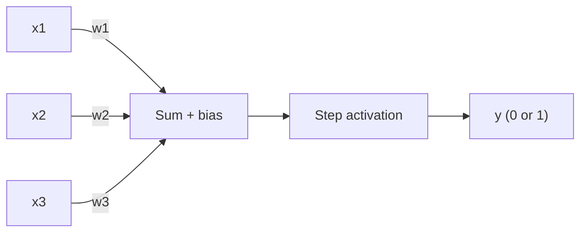

# Perceptron from scratch

A minimal implementation of Rosenblatt's perceptron using only NumPy — no ML frameworks. Built to demonstrate the core learning rule, and its limits, from first principles.

## Architecture



Each input is multiplied by a learned weight, summed with a bias, and passed through a step function to produce a binary output.

## Learning rule

```
error = target - prediction
weight += learning_rate * error * input
bias  += learning_rate * error
```

Weights only move when a prediction is wrong, nudging the decision boundary toward the correct classification.

## Installation

```bash
git clone https://github.com/SinghSuraj-04092002/perceptron-from-scratch.git
cd perceptron-from-scratch
pip install -r requirements.txt
```

## Usage

```bash
python examples/and_gate.py
python examples/xor_failure.py
```

## Results

### AND gate — linearly separable, converges

The perceptron reaches zero misclassifications within a few epochs and correctly predicts all four input combinations.

### XOR gate — not linearly separable, never converges

`examples/xor_failure.py` trains on XOR and saves a plot (`xor_failure.png`) showing the misclassification count oscillating instead of reaching zero. This is the classic proof that a single perceptron can only separate classes with a straight line/hyperplane — XOR requires a non-linear boundary, which is why multi-layer perceptrons (with hidden layers and non-linear activations) exist.

## Tests

```bash
pytest tests/
```

Covers: binary output shape, AND convergence, XOR non-convergence, and batch prediction shape.

## Project structure

```
perceptron-from-scratch/
├── perceptron/          # core implementation
│   └── model.py
├── examples/            # runnable demos
│   ├── and_gate.py
│   └── xor_failure.py
├── tests/               # pytest suite
└── requirements.txt
```

## License

MIT
